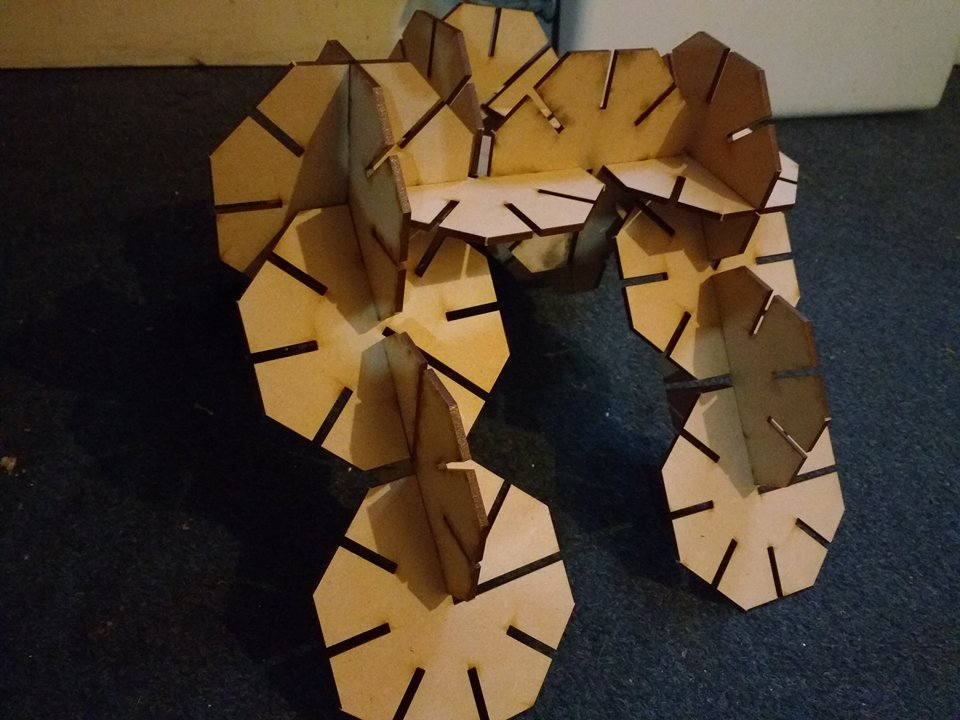
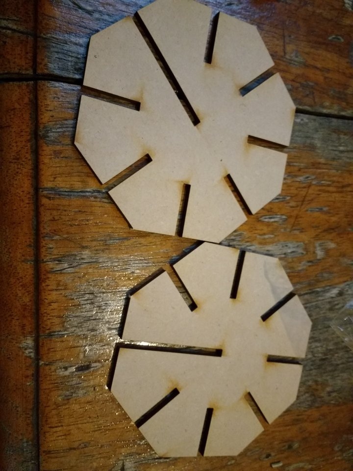
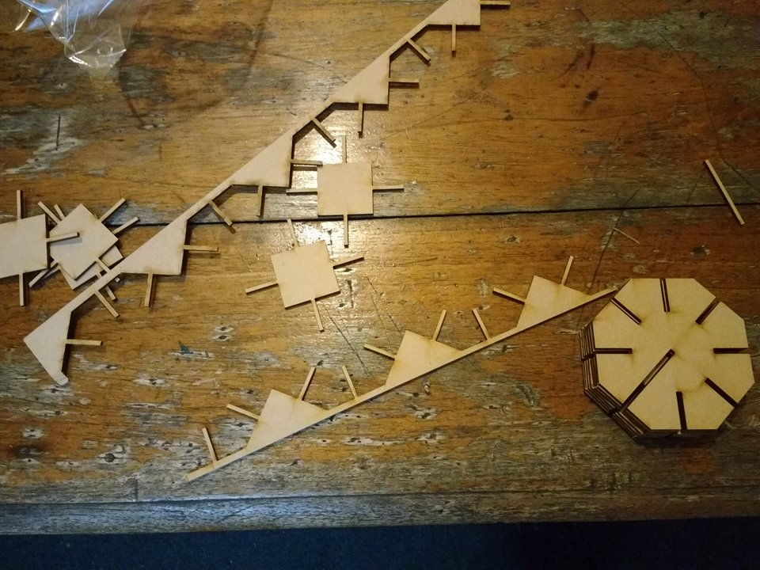

Laser boot, cut 3: Heckballs
============================

Photos by Amapola Kieslowski.

Heckballs are an edge-lap construction-set design I developed based on
some ideas Matt Heck showed me in 2005 or 2006.  I went and got this
design fabricated at [Max58][1] on 2016-08-27 for AR$400.

[1]: http://www.cortelaserpalermo.com.ar/

This version is made of 3-mm-thick MDF octagons that are 100 mm across
the flats with a 23.5-mm-long slit in the center of each side, except
that one side has a 50-mm slit in it instead, so that two octagons can
be slid together to make a sort of ball with 12 available slits for
making edge-lap joints with other octagons.

This design is just what I managed to put together Saturday morning in
the hour after waking up, using plain PostScript,
which is the CAD equivalent of stone knives.
It’s missing a lot of things, but I thought
it would be a mistake to miss out on the feedback available from
fabricating it in order to perfect the design further.

Design parameters
-----------------

I chose 100 mm as the octagon size across the flats because it seemed
like a good balance between cutting cost and material cost,
particularly for future versions that have more elaborate outlines.

I used 0.75 mm tabs to connect the octagons to keep them from falling
out of the sheet during cutting.  They came out to be a bit less than
0.75 mm wide, and were probably a bit too thin; it was easy to break
them by accident.

I left an extra 150 μm on the width of the slits for the edge-lap
joints, and as a result, all of the pieces slide together and apart
easily.  Unfortunately, they slide apart so easily that assemblies
sometimes just fall apart under the weight of an octagon.

23.5 mm was the result of an erroneous calculation.  I wanted the
octagons to butt up against the center octagon, if any, so I
subtracted half the thickness (the thickness was 3 mm, so I subtracted
1.5 mm) from the slit depth.  But the total overlap when two slits are
interconnected is twice the slit depth, so now octagons reaching
toward the center from opposite sides have 6 mm between them, not 3.

This version doesn’t do any stress relief at the corners, making it
weaker than necessary and also unnecessarily hard on the hands.

This version contains 32 octagons, totaling 800 mm × 400 mm.

Observations
------------

Initial kid testing resulted in great enthusiasm.

The extra slop in the slits leads to some slop in the angular fit of
the joints, enough to be bothersome.  I hope to fix much of the slop
using snap joints in a future version.

I was thinking that it would be possible to connect four octagons to a
ball to make the apex of a regular octahedron.  But of course they
interfere with each other, so you can’t do that.  When I add beams,
this will be a constraint on the beam dimension.

Durability is surprisingly good despite the lack of fillets or other
stress relief.  Two octagons penetrating through each other to make a
ball can be relatively easily squashed with maybe 64 N of force,
cracking the MDF around the joint; but surprisingly, this doesn’t
destroy them completely, and they even spring back to their original
form.  Even more surprisingly, this compensates for the too-wide
slits.  Even repeating this overstressing procedure 100 times does not
result in the octagon breaking apart.

However, breaking an octagon in half when it isn’t part of a ball is
fairly easy, even if it hasn’t been overstressed in this way.
Overstressing it leaves it weakened and even easier to break.  Bending
it by about 15° at the 26.5-mm-long space between the lengthened slit
and its opposite is sufficient; it’s also possible to tear it at this
spot, nearly as if it were paper.  These are disappointing.  Generous
stress relief fillets would help with all of these, but it’s likely
that making it really kid-resistant will require the use of
significantly thicker MDF.  Extrapolating quadratically, an acceptable
256-N squish resistance would probably require 6 mm if the pieces were
to be individually cut out of MDF rather than assembled.  Max58 stocks
thicknesses of 5.5 mm and 9 mm.

Making the octagons smaller would help with strength by reducing the
lever arm available to accidental forces.

Assembling and disassembling the same pair of slits 100 times in
various states of misalignment resulted in some mild but visible
surface wear and little bits of sawdust all over my sweater.  No
difference in joint play was detectable.  Also, the various
misalignments made my hands very tired.  Probably chamfering or
rounding the edge corners of the slits would ameliorate the wear in
this situation.

This repeated assembly and disassembly also left a little bit of
visible marking from the cut surfaces on the uncut surfaces, a kind of
brown tarry deposit from laser-burning.  This tarry deposit is
probably “pyroligneous acid”, which is to say, wood smoke.  How much
carcinogenic benzopyrene it contains I don’t know.

About 20% of the sheet was wasted as scraps (“sobrante”) in squares
between the octagons.  The axles sticking out of their sides are
3.15 mm × 3 mm, and work very well for spinning them between your
fingers.  Taking advantage of this scrap would be an excellent way to
increase the productivity of the process, since it’s already cut on
most sides.

Fabrication process and costs
-----------------------------

I watched the laser cutter cutting.  It took about a second to cut
each of the “freesidelength” lines, which turn out to be about
19.14 mm long, so this was cut at roughly 20 mm per second.  The total
cutting time was 17'26".  It burst into flame at several points during
the cutting process, never for more than a couple of seconds, and
never leaving any visible deposit.

The peso is
currently at AR$15.20 to the dollar, so the AR$400 I paid is US$26.32.
Unfortunately then I had to take a taxi for an extra AR$80.  This is
about twice what I originally expected to pay, so I need to revise my
mental cost model somehow.

This works out to 32.7 seconds per octagon, AR$12.50 (US$0.82) per
octagon, and AR$0.382 (US$0.0251) per second.

Reviewing my notes, it seems like my original cost model was that 3 mm
MDF should US$2.50/m², the cutting should happen at 30 mm/s, and the
cutting should cost US$40 per hour, which would be the bulk of the
cost.  Ultimately it seems like I was persuaded to use a smaller scale
in order to fit an entire construction set into a single cutting
session, which was probably a bad decision.

I need to write some accurate cut path length calculation software,
but a basic estimate is that each octagon contained seven regular
slits (each 23.5+3.15+23.5 = 50.15 mm), one deep slit (50+3.15+50 =
103.15 mm), and 12 "freesidelength" sides (19.14 mm, as it turns out).
This works out to about 684 mm of cutting per octagon, or 21.9 m of
cutting for the whole sheet, a total of 20.9 mm per second.

Comparative cost: how are we doing?
-----------------------------------

Legos are made by traditional mass-production methods,
injection-molding ABS, I think, unless it’s HIPS.  The Lego Creator
31029 Construction Block Set: cargo helicopter/airplane/boat has 132
pieces and costs the same AR$400 on MercadoLibre at the moment.  The
helicopter blades are 17 horizontal lego-units long from tip to tip;
[Robert Cailliau informs us][0] that a horizontal lego-unit is 8 mm,
so this is 136 mm, minus the horizontal tolerance at each end.

[0]: http://www.robertcailliau.eu/Lego/Dimensions/zMeasurements-en.xhtml

This entire Lego set is roughly the size of a single octagon, which is
probably a point in favor of Heckballs.  But the Lego set has more
than four times as many pieces, resulting in enormously more possible
configurations.

A half-scale Heckballs set, using 50-mm octagons, would contain 144
octagons in the same 810×450 space, and would take about twice as long
to cut (35' or so).  It would also be somewhat more durable.  I don’t
know if the longer cutting time would double the cost or somewhat
less.  If it merely doubled, then we would hit per-piece crossover
cost with Legos another scale factor of two up: 25-mm octagons, 576
pieces, $1600, 70' of cutting, AR$2.78 per piece compared to Lego’s
$3.03.  Also, all 576 or so pieces could be different, which is more
challenging for Legos.  But at that scale you probably need to use
thinner material, which would drop the cost again, partly because it's
faster to cut thinner material.

Next steps
----------

I should fabricate a new version of Heckballs on my next opportunity,
which is in two days.  I want to incorporate the following
improvements:

1. Chamfered outside corners to reduce assembly wear, ease off-axis
   assembly, and be easier on hands.

2. It needs inside corner divots to reduce stress when things get
   twisted together.

3. It should be prettier, somehow.  Maybe cutting inward at the
   corners in a curvy or spiraly kind of way or something.

4. Smaller scale, for strength and for expressiveness (i.e. more
   separate pieces per meter of cut, permitting more combinations).
   This may bring the cutting cost out of balance with material cost,
   I’m not sure.

5. I should maybe paint it to cover up the burn marks and the tarry
   residue on the edges, which suggests adding an allowance for paint
   thickness in the slots.  Maybe this is a future version.

6. I need beams!  Add beams.

7. I should correct the slit depth, and also I should do the collision
   allowance by reducing the outside size of the octagons, not by
   reducing the slit depth.  Also it needs to take into account the
   45° pieces.

8. I should use 1 mm tabs.

9. I should slit the scraps so they become pieces.

10. I should eliminate the 150 μm allowance or make it much smaller.
    Maybe 30 μm.

11. Use snap joints, if I can figure out how, to give the joints
    significant tensile strength without making them hard to take
    apart.

<link rel="stylesheet" href="http://canonical.org/~kragen/style.css" />

